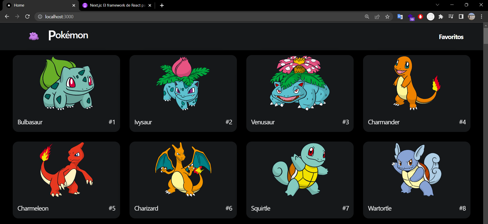
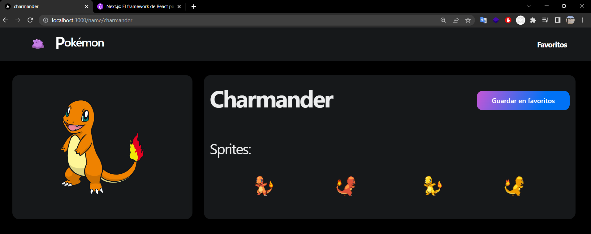
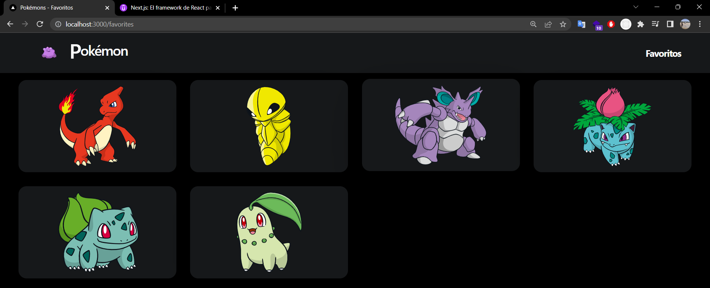

# Pokemon static!

- PokeApi
- nextui
- canvas-confetti
- typescript
- GetStaticProps
- Incremental Static Regenerations
- Incremental Static Generations

## Screenshots:
1. Home:

  

2. Pokemon details:

  

3. Favorites:

  

 
 

This examples are part from the [Next.js: El framework de React para producción](https://www.udemy.com/course/nextjs-fh/)